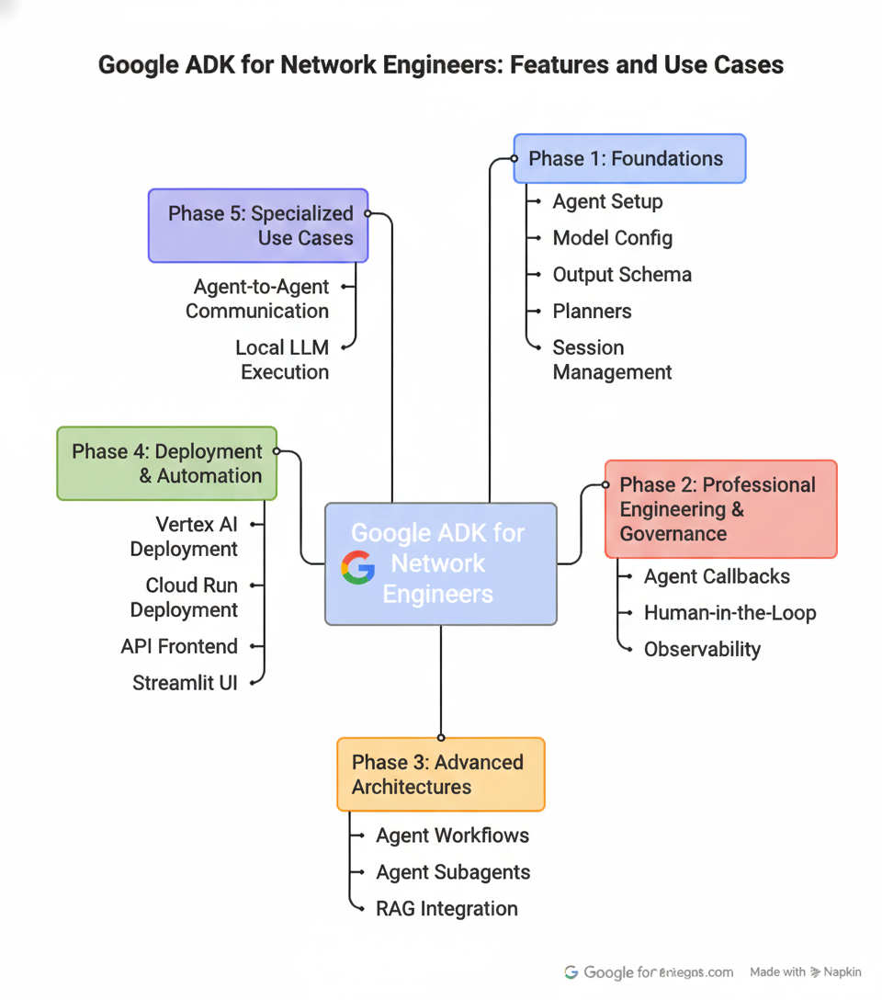
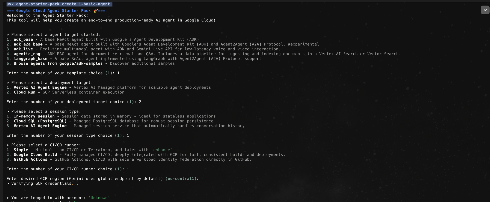

# 🚀 Google Agent Development Kit (ADK) for Network Engineers ft. Agent Starter Pack

[](https://www.python.org/)
[](https://fastapi.tiangolo.com/)
[](https://cloud.google.com/agent-development-kit)
[](https://www.docker.com/)
[](https://docs.astral.sh/uv/)
[](https://modelcontextprotocol.io/)

> **Build trustworthy, production-ready AI agents for network automation and operations.**  

> **Solve real network problems while mastering Google's Agent Development Kit—an industry-leading agentic framework.**

---


---

## 📑 Table of Contents

- [📖 Overview](#-overview)
  - [🎯 Audience for this project ?](#-audience-for-this-project-)
  - [📦 What's Included?](#-whats-included)
- [🎯 Tutorial Contents and Sections](#-tutorial-contents-and-sections)
  - [📘 Phase 1: The Foundations](#-phase-1-the-foundations)
  - [🛡️ Phase 2: Professional Engineering & Governance](#️-phase-2-professional-engineering--governance)
  - [🏗️ Phase 3: Advanced Architectures](#️-phase-3-advanced-architectures)
  - [🚀 Phase 4: Deployment & The "Automation Story"](#-phase-4-deployment--the-automation-story)
  - [🔬 Phase 5: Specialized Use Cases](#-phase-5-specialized-use-cases)
- [🚀 Let's get started](#-lets-get-started)
  - [✅ Prerequisites](#-prerequisites)
  - [🎨 Agent Starter Pack](#-agent-starter-pack)
- [🌐 Auth with Google Cloud](#-auth-with-google-cloud)
- [📁 Project Structure](#-project-structure)
- [⚡ Quick Start](#-quick-start)
- [🤝 Contributing](#-contributing)
- [📄 License](#-license)
- [🔮 Long-Term Vision](#-long-term-vision)

## 📖 Overview

Network engineers need AI systems that are **understandable**, **trustworthy**, and **operationally relevant**. Traditional script-based automation is brittle and lacks contextual reasoning, while black-box AI chatbots lack the control, observability, and accountability required for production network operations.

This project bridges that gap by demonstrating how Google's Agent Development Kit (ADK)—one of the leading agentic frameworks—enables network engineers to build **agent-based systems** that combine the flexibility of AI with the rigor of production operations.

Read basics about Agents, Framework and Google ADK and Agent Starter Pack in [Introduction.md](./Introduction.md) file.

### 🎯 Audience for this project ?

Learn how GenAI agents work while tackling real-world use cases faced by:
- **🔧 Network Engineers** - Design reviews, configuration validation, architectural analysis
- **⚙️ Network Automators** - BGP troubleshooting, device diagnostics, workflow orchestration
- **🛠️ SRE Teams** - Multi-turn troubleshooting, observability integration, production deployments
- **📡 NOC Teams** - Context-aware assistance, incident response, state-aware diagnostics
- **🤖 AI Engineers** - Learn how to build production-ready agents using Google's Agent Development Kit

### 📦 What's Included?

This repository provides a collection of **complete, production-ready agents** (not just prompts) built using Google's Agent Development Kit. Each example demonstrates how ADK features map directly to real-world network operations, with:

- ✅ **Complete Working Code** - Ready-to-run implementations with all dependencies
- 🌐 **Network-Specific Use Cases** - Real scenarios from production environments
- 🎓 **ADK Feature Demonstrations** - Practical examples of advanced agent capabilities
- 🧪 **Safe Testing Environment** - Mocked backends for safe experimentation (swap with real APIs when ready)

---
## 🎯 Tutorial Contents and Sections:





### 📘 Phase 1: The Foundations

Start here to understand the core concepts of AI agents.

| Topic | ADK Feature | Networking Use Case | Link |
|------|-------------|---------------------|------|
| `1-basic-agent/` | Agent Setup, Model Config, Output Schema, Planners, Session Management | **Network Design Review Agent** - AI-powered architectural review for network designs | [View Details](./1-basic-agent/) |
| `2-basic-agent-with-tools/` | Custom Tools, Built-in Tools, Parallel Execution, Agent-as-Tool, MCP Integration | **BGP Troubleshooting Assistant** - Systematic diagnosis of BGP session issues using multiple tool patterns | [View Details](./2-basic-agent-with-tools/) |
| `3-agent-session-context/` | Session State, ToolContext, ReadonlyContext, FunctionTool, Multi-Turn Conversations | **Multi-Turn NOC Assistant** - Context-aware troubleshooting with state persistence across conversation turns | [View Details](./3-agent-session-context/) |

---

### 🛡️ Phase 2: Professional Engineering & Governance

Critical for production-ready network AI operations.

| Path | ADK Feature | Networking Use Case | Link |
|------|-------------|---------------------|------|
| `5-agent-callbacks-guardrails/` | Agent/Model/Tool Callbacks, CallbackContext, Content Filtering, Access Control | **Production Security & Control** - Callback-based guardrails for policy enforcement (e.g., prevent invalid BGP commands) | [View Details](./5-agent-callbacks-guardrails/) |
| `4-agent-human-in-the-loop/` | HITL Confirmation, ResumabilityConfig, Boolean & Tool-Based Approval Patterns | **Configuration Change Approval** - Safety-first network config with human approval gates for high-stakes changes | [View Details](./4-agent-human-in-the-loop/) |
| `10-agent-observability/` | Python Logging, Opik Integration, Trace Visualization, LLM Metrics Tracking | **Production Observability** - Comprehensive logging and tracing—the "audit trail" for network changes | [View Details](./10-agent-observability/) |

---

### 🏗️ Phase 3: Advanced Architectures

Move from single tasks to complex, modular agent systems.

| Path | ADK Feature | Networking Use Case | Link |
|------|-------------|---------------------|------|
| `6-agent-workflows/` | SequentialAgent, ParallelAgent, LoopAgent, Nested Workflows, Exit Control | **Automated Network Troubleshooting Workflows** - Complex sequences (Verify BGP → Run CyPerf Test → Analyze Results) | [View Details](./6-agent-workflows/) |
| `7-agent-subagents/` | Hierarchical Multi-Agent, Sub-Agent Delegation, Parent Orchestration, Dynamic Task Routing | **Hierarchical Network Operations** - Modular approach: one agent for security, another for performance benchmarking | [View Details](./7-agent-subagents/) |
| `8-agent-rag-WIP/` | RAG Integration, Document Retrieval, Knowledge Base | **Documentation-Aware Agent** - Connect to technical documentation and network topologies *(Work in Progress)* | [View Details](./8-agent-rag-WIP/) |

---

### 🚀 Phase 4: Deployment & The "Automation Story"

Deploy agents to production and enable integration with other systems.

| Path | ADK Feature | Networking Use Case | Link |
|------|-------------|---------------------|------|
| `12-agent-deployment-vtxai/` | Vertex AI Agent Engine, Managed Runtime, State Management, Secure Code Execution, Enterprise Observability | **Vertex AI Agent Engine Deployment** - Managed enterprise-grade runtime with built-in playground UI | [View Details](./12-agent-deployment-vtxai/) |
| `11-agent-deployment-cloudrun/` | Cloud Run Deployment, Cloud Build, IAM Policy Binding, Dockerfile Configuration, Serverless Containers | **Cloud Run Deployment** - Serverless containerized agent with automatic scaling and IAM access control | [View Details](./11-agent-deployment-cloudrun/) |
| `13-agent-react-frontend/` | REST API, FastAPI, React Frontend | **REST API Integration** - Expose agents via REST API for consumption by other systems | [View Details](./13-agent-react-frontend/) |
| `13-agent-streamlit-ui/` | Streamlit, Web UI, Interactive Chat | **Streamlit GUI** - Browser-based interface for engineers to interact without CLI | [View Details](./13-agent-streamlit-ui/) |

---

### 🔬 Phase 5: Specialized Use Cases

Advanced patterns for specific operational requirements.

| Path | ADK Feature | Networking Use Case | Link |
|------|-------------|---------------------|------|
| `9-agent-a2a-asp/` | RemoteA2aAgent, Agent Cards, HTTP Communication, Microservices Architecture | **Agent-to-Agent Communication** - Distributed NOC with agents communicating via HTTP | [View Details](./9-agent-a2a-asp/) |
| `14-agent-ollama/` | LiteLLM, Ollama, Local LLM Execution | **Local LLM Execution** - Run agents with local models for sensitive network environments where data cannot leave premises | [View Details](./14-agent-ollama/) |

---

## 🚀 Let's get started:

### ✅ Prerequisites

Before you begin, ensure you have:
- 🐍 **[uv](https://docs.astral.sh/uv/getting-started/installation/)** - Python package manager (handles all dependency management)
- ☁️ **[Google Cloud SDK](https://cloud.google.com/sdk/docs/install)** - For GCP services integration
- 🔨 **[make](https://www.gnu.org/software/make/)** - Build automation (pre-installed on most Unix systems)
- 🔑 **Google Gemini API Key** - Set as environment variable: 

 ```bash
 export GOOGLE_API_KEY=<your-key>
 ```
> **Note:** <br>You can get your Google Gemini API key from [Google Cloud Console](https://ai.google.dev/gemini-api/docs/api-key)

### 🎨 Agent Starter Pack
For scaffolding new agents, we have used  Google's Agent Starter Pack.
**[agent-starter-pack](https://github.com/GoogleCloudPlatform/agent-starter-pack)**—is Google's open-source CLI that handles infrastructure setup, CI/CD, and observability. for agents so developers can focus on agent logic (prompts, tools, RAG) instead of boilerplate.




By default, the agent folder name is `app` and the agent file name is `agent.py` when we create the agent with the Agent Starter Pack. You can change the folder name and agent file name as you wish. However, in that case you need to modify the Makefile and other files to match the new names.


## 🌐 Auth with Google Cloud 
Once you have the Google Cloud SDK installed, you need to authenticate with Google Cloud so that once you test agent locally you can eventually deploy it to Cloud.

```bash
gcloud auth login
```

```bash
gcloud config set project <your-project-id>
```

```bash
gcloud config set region <your-region>
```

```bash
gcloud auth login --update-adc --project <your-project-id>
```


## 📁 Project Structure  ( Please note the naming convention of the folders)

Each example follows a consistent structure for easy navigation:

I have changed the agent folder name to `basic_agent` from `app` since I wanrt to match the purpose of the agent in this case.

```
1-basic-agent/                    # Agent Parent folder (example name)
├── README.md                     
├── basic_agent/                  # Agent folder
│   ├── __init__.py
│   ├── agent.py                  # 🧠 Core agent logicfile [Main Agent] 
│   ├── fast_api_app.py           # 🌐 Start API Server to interact with the agent
│   └── app_utils/                # 🔧 Utilities and helpers [Tools]
├── tests/                        
│   ├── unit/
│   └── integration/
├── pyproject.toml               # 📦 Project dependencies (uv) [Dependencies]
├── uv.lock                      # 🔒 Locked dependencies [Dependencies]
├── Makefile                     # ⚙️ Common tasks (install, test, deploy) [Makefile]
└── Dockerfile                   # 🐳 Container configuration to push to Cloud Run [Dockerfile]
```


** If  we have multiple agents in same folder there will be multiple agent.py files inside those agent folders.

Example:

```bash
basic-agent-with-tools/
├── agent_as_tool/
├── agent_google_cloud_tools_WIP/
├── agent_custom_tools/
├── agent_builtin_tools/
├── agent_mcp_tools_calls/
├── parallel_functions_calls/
├── tests/
├── Makefile
├── pyproject.toml
├── uv.lock
├── Dockerfile
└── README.md 
```


How to interact with the agent ?

0) Always first in the Agent Parent folder, run below to install the dependencies.

```bash
cd <agent-parent-folder>
make install
```

1) To spin up a local development UI for agent interacction. ( Web UI Interaction with the agent)

```bash
make playground
```

2) To spin up the local development server with hot-reload. ( API Interaction with the agent)
```bash
make local-backend (Some agents have modified local-backend make command to match the agent folder name. Check Makefile before running the command.)
```
**💡 Note:** No virtual environment management needed—`uv` handles dependency isolation automatically.


3) Chat with the agent using CLI

```bash
cd <agent-parent-folder>
uv run adk run <agent-folder>
```


### Very Important:
> Open Makefile to understand the underlying adk command being used.  We need to modify these commands when we modify the default names of files created as a part of the Agent Starter Pack. You will see this in the indidual aagent readme.
---

### ⚡ Quick Start

0. **📚 Find sample queries** to use with every agent in the [SAMPLE_QUERIES.md](./SAMPLE_QUERIES.md) file.

1. **📥 Clone the repository**
   ```bash
   git clone https://github.com/yourusername/GoogleADK-NetworkAutomation.git
   cd GoogleADK-NetworkAutomation
   ```

2. **▶️ Choose an example and run it**
   ```bash
   cd 1-basic-agent
   make install && make playground
   ```

   **Note:** <br>Without Agent Starter Pack, you would have to use 
   Local Development & Testing (`adk web`, `adk run`, `adk api_server`) commands to run and interact with the agent.
   Under the hood, Agent Starter Pack is running same commands . Check the Makefile for more details.

   The playground will launch a web interface where you can interact with the agent.

   ```bash
  
   +-----------------------------------------------------------------------------+
   | ADK Web Server started                                                      |
   |                                                                             |
   | For local testing, access at http://127.0.0.1:8501.                         |
   +-----------------------------------------------------------------------------+
   ```
3. **🔍 Explore the code**
   - 📖 Review `README.md` in each example for use case details
   - 💻 Examine `agent.py` files to understand agent implementation


## 🤝 Contributing

Contributions are welcome! This project aims to be a comprehensive resource for network engineers learning AI agent development.

**🎯 Areas of Interest:**
- 🌐 Additional network automation use cases
- 🔌 Integration examples with network device APIs
- 🚀 Production deployment patterns
- 📊 Observability and monitoring enhancements

Please ensure contributions maintain the project's focus on clarity, safety, and operational relevance.

---

## 📄 License

This project is provided as-is for educational and operational purposes. Please review individual dependencies and ensure compliance with your organization's policies.

---

**Built with ❤️ for Network Engineers by Network Engineer [Ashwin Josh](https://www.linkedin.com/in/ashjoresume)**

